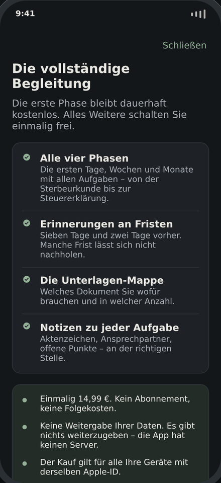

# Danach – Der Trauerfall-Navigator

Eine native iOS-App, die Hinterbliebene in Deutschland nach einem Todesfall
Schritt für Schritt durch die Formalitäten begleitet.

Die App ist ein ruhiger Begleiter in einer Ausnahmesituation – kein
Produktivitätstool. Keine Gamification, keine Badges, keine Feier bei
100 Prozent. Nur: Was ist jetzt zu tun, warum, bis wann, und was brauche ich
dafür.

**Die App ersetzt keine Rechtsberatung.** Alle Angaben sind allgemeine
Orientierung.

## So sieht es aus

| Aufgaben | Aufgabendetail | Fristen |
|---|---|---|
|  |  |  |

| Paywall im Dunkelmodus | Schrift auf 170 Prozent |
|---|---|
|  |  |

Die Bilder stammen aus der Browser-Vorschau, nicht aus dem Simulator. Auf dem
Gerät rendert iOS in SF Pro; hier steht eine Ersatzschrift, die etwas breiter
läuft.

## Grundsätze

- **Komplett lokal.** Kein Backend, kein Account, kein Tracking, keine
  iCloud-Synchronisierung. Alle Daten bleiben auf dem Gerät. Bei diesem Thema
  ist das keine Nebensache, sondern die Voraussetzung für Vertrauen.
- **Barrierefrei.** Dynamic Type bis zu den größten Stufen, VoiceOver-Labels,
  hohe Kontraste, Tippziele ab 52 pt. Ein großer Teil der Nutzer ist über 60.
- **Inhalte ohne Code pflegbar.** Der gesamte Aufgaben- und Dokumentenkatalog
  liegt als JSON im Bundle.

## Technik

| | |
|---|---|
| Sprache | Swift 5, SwiftUI |
| Mindestversion | iOS 17 |
| Persistenz | SwiftData |
| Erinnerungen | UNUserNotificationCenter, rein lokal |
| Kauf | StoreKit 2, Einmalkauf, kein Abo |

## Projektstruktur

```
Danach.xcodeproj/          Xcode-Projekt (synchronisierte Ordner, Xcode 16+)
project.yml                XcodeGen-Beschreibung als Ersatzweg
Danach/
  App/                     Einstieg, Wurzelansicht, Tab-Navigation
  Models/
    Enums.swift            Phase, Sterbeort, Verhältnis, Status
    ContentModels.swift    Codable-Modelle für den JSON-Katalog
    PersistentModels.swift SwiftData: Profil, Aufgaben-, Dokumentenzustand
  Content/
    tasks_de.json          Aufgabenkatalog
    documents_de.json      Dokumentenkatalog
    ContentStore.swift     Laden und Filtern
  Services/                Fristen-Engine, Benachrichtigungen, Kauf
  DesignSystem/Theme.swift Farben, Abstände, Bausteine
  Views/                   Onboarding, Phasen, Fristen, Dokumente, …
  Resources/               Asset-Katalog
Tools/validate_content.mjs Prüft den JSON-Katalog
Configuration/             StoreKit-Testkonfiguration
```

## Datenmodell: warum getrennt

Der Inhalt einer Aufgabe (Titel, Erklärtext, Frist, Bedingungen) steht **nur**
im JSON. SwiftData speichert **nur** den Nutzerzustand – Status, Notiz,
angepasste Frist – referenziert über die `taskID`.

Damit lassen sich Inhalte per App-Update korrigieren und erweitern, ohne dass
Notizen oder Häkchen der Nutzer angefasst werden. Der umgekehrte Weg – Aufgaben
beim ersten Start in die Datenbank kopieren – wäre einfacher gewesen, hätte aber
jede Content-Korrektur zu einer Migration gemacht.

## Content-Schema

Eine Aufgabe in `tasks_de.json`:

```json
{
  "id": "sterbeurkunde_standesamt",
  "phase": 2,
  "title": "Sterbefall beim Standesamt anzeigen",
  "summary": "Ein Satz für die Liste.",
  "details": "Ausklappbarer Text: was, warum, worauf achten.",
  "documents": ["Todesbescheinigung", "Stammbuch"],
  "contacts": ["Standesamt des Sterbeortes"],
  "tips": ["Fünf bis zehn Ausfertigungen bestellen."],
  "deadline": {
    "type": "relative",
    "unit": "business_days",
    "amount": 3,
    "label": "spätestens am dritten Werktag",
    "strict": true,
    "note": "§ 28 Personenstandsgesetz"
  },
  "conditions": { "placeOfDeath": ["home"] },
  "priority": 1
}
```

| Feld | Bedeutung |
|---|---|
| `id` | eindeutig, nur `a–z`, `0–9`, `_`; wird als Schlüssel gespeichert und darf sich nie ändern |
| `phase` | 1 bis 4 |
| `deadline.type` | `relative` (ab Sterbedatum) oder `from_knowledge` (ab Kenntnis, wird behelfsweise ab Sterbedatum gerechnet) |
| `deadline.unit` | `hours`, `days`, `business_days`, `months` |
| `deadline.amount` | Zahl; `days` wird als Kurzschreibweise akzeptiert |
| `deadline.strict` | `true` = gesetzliche oder vertragliche Frist, `false` = Empfehlung |
| `conditions` | innerhalb eines Feldes ODER, zwischen den Feldern UND; fehlt ein Feld, passt die Aufgabe immer |
| `priority` | Reihenfolge in der Phase, kleiner steht oben |

Mögliche Bedingungswerte: `placeOfDeath` = `home`, `hospital`, `care_home`,
`elsewhere` · `relationship` = `spouse`, `partner`, `child`, `parent`, `other` ·
`hasWill` und `hasFuneralProvision` = `yes`, `no`, `unknown`.

## Prüfen ohne Xcode

Alle vier Prüfungen laufen unter Linux und macOS, ohne Xcode:

```bash
cd Tools && npm install && cd ..

node Tools/validate_content.mjs      # Aufgaben- und Dokumentenkatalog
node Tools/check_swift.mjs Danach    # Swift-Syntax aller Dateien
node Tools/check_symbols.mjs Danach  # verwendete gegen deklarierte Typen
python3 Tools/check_project.py       # Struktur der Xcode-Projektdatei
```

| Prüfung | Was sie findet | Was sie nicht findet |
|---|---|---|
| `validate_content` | Schemafehler, doppelte IDs, unbekannte Bedingungswerte, leere Phasen über alle 180 Onboarding-Kombinationen | inhaltliche Fehler in den Texten |
| `check_swift` | Syntaxfehler in allen Swift-Dateien, per tree-sitter | Typfehler – dafür braucht es einen Compiler |
| `check_symbols` | Verweise auf Typen, die es nicht gibt, etwa nach einer Umbenennung | falsche Signaturen |
| `check_project` | kaputte Projektdatei, unbekannte Objekt-IDs, fehlendes Schema | fehlerhafte Build-Einstellungen |

Dieselben vier Schritte laufen in GitHub Actions bei jedem Push.

Das App-Icon wird ebenfalls aus Code erzeugt, damit Änderungen nachvollziehbar
bleiben:

```bash
python3 -m pip install Pillow
python3 Tools/make_appicon.py
```

## Vorschau im Browser

Bevor Sie Xcode öffnen, lässt sich die App klickbar im Browser ansehen –
alle Bildschirme, echte Inhalte, echte Fristberechnung:

```bash
python3 Tools/preview/build.py
open Tools/preview/index.html
```

Screenshots aller Bildschirme in hell und dunkel erzeugt:

```bash
cd Tools && npm install playwright-core && cd ..
node Tools/preview/shoot.mjs "$PWD/Tools/preview/index.html" Tools/preview/screenshots
```

Die Vorschau setzt den Inhalt aus `Danach/Content` in eine Einzeldatei ein
und bildet Onboarding, Phasen, Aufgabendetail, Fristen, Unterlagen, Paywall
und Einstellungen nach. Sie hat einen Regler für Dynamic Type, damit
sichtbar wird, wie das Layout bei stark vergrößerter Schrift hält.

Sie ist Beurteilungshilfe, kein Ersatz für den Simulator: Wischgesten,
Tastatur, Benachrichtigungen und StoreKit fehlen.

## Bauen

Xcode 16 oder neuer, `Danach.xcodeproj` öffnen, Schema `Danach`, Simulator ab
iOS 17. Das Projekt nutzt synchronisierte Ordner: neue Dateien im Ordner
`Danach/` werden automatisch Teil des Targets.

Das geteilte Schema verweist bereits auf `Configuration/Danach.storekit`. Die
Kaufstrecke funktioniert damit im Simulator sofort, ohne Eintrag in App Store
Connect.

Beim ersten Öffnen fragt Xcode nach einem Signing-Team. Unter *Signing &
Capabilities* Ihr Team auswählen; der Bundle-Identifier ist
`de.movingape.danach`.

## Rechtliches

Die Inhalte beruhen auf öffentlich zugänglichen Checklisten von Stiftung
Warentest, dem Bundesverband Deutscher Bestatter und den Verbraucherzentralen
sowie auf den einschlägigen Gesetzen (BGB, PStG, ErbStG, SGB VI). Bestattungs-
und Friedhofsrecht ist Landesrecht und unterscheidet sich je nach Bundesland;
die App weist an den betroffenen Stellen darauf hin.

## Stand der Umsetzung

| Bereich | Stand |
|---|---|
| Datenmodell, Content-Schema, Loader | fertig |
| Onboarding, Phasen, Aufgaben, Fristen, Unterlagen, Einstellungen | fertig |
| Fristen-Engine inkl. Werktagen und Feiertagen | fertig |
| Lokale Erinnerungen | fertig |
| StoreKit 2, Paywall, Wiederherstellung | fertig |
| Aufgabenkatalog | 59 Aufgaben, 18 Unterlagen |
| App-Icon | fertig, aus Code erzeugt |
| Syntaxprüfung aller Swift-Dateien | grün |
| Kompilierlauf in Xcode | grün, ohne Warnungen (Xcode 26, iPhone 17) |
| Durchlauf im Simulator | Onboarding, Aufgaben, Fristen, Erinnerungen geprüft |

### Vor der Veröffentlichung

Alles Vorbereitbare liegt fertig in `AppStore/`. Offen bleibt:

- [ ] Angaben in eckigen Klammern ersetzen – an drei Stellen:
      `Danach/Views/Settings/LegalViews.swift` (ImprintView),
      `AppStore/website/impressum.html`, `AppStore/website/datenschutz.html`.
      Finden mit `grep -rn "\[" AppStore/website/*.html`
- [ ] Signing-Team in Xcode setzen
- [ ] Website veröffentlichen, siehe `AppStore/website/README.md`
- [ ] Produkt `de.movingape.danach.vollversion` in App Store Connect anlegen
- [ ] Texte aus `AppStore/metadaten.md` übernehmen
- [ ] Screenshots: erst mit `node Tools/preview/appstore.mjs` als Entwurf,
      später durch echte Simulator-Aufnahmen ersetzen
- [ ] `tasks_de.json` von einem Fachanwalt für Erbrecht gegenlesen lassen

Die vollständige Schritt-für-Schritt-Anleitung steht in
[`AppStore/anleitung.md`](AppStore/anleitung.md).

### Was für den Store schon fertig ist

```
AppStore/
  anleitung.md          Schritt für Schritt bis zur Einreichung
  metadaten.md          Name, Untertitel, Beschreibung, Schlüsselwörter,
                        Kategorien, Datenschutzangaben, Prüfhinweise
  website/              Support-, Datenschutz- und Impressumsseite,
                        fertig für GitHub Pages
Danach/Resources/PrivacyInfo.xcprivacy   Datenschutz-Manifest
Tools/preview/appstore.mjs               Screenshots im Store-Format
```


### Was maschinell geprüft ist und was nicht

Das Projekt entstand in einer Linux-Umgebung ohne Xcode. Maschinell geprüft
sind Content-Schema, Swift-Syntax aller 27 Dateien, Typverweise und die
Struktur der Projektdatei.

Der erste echte Kompilierlauf ist inzwischen nachgeholt: Xcode 26 übersetzt
das Projekt ohne Fehler und ohne Warnungen, die befürchteten Korrekturen an
SwiftUI-Modifiern waren nicht nötig. Ein Durchlauf im Simulator bestätigt
Onboarding, Aufgabenliste, Fristenberechnung und die Rückfrage nach
Erinnerungen.

Nicht auf einem Gerät geprüft sind bislang der tatsächliche Kaufvorgang gegen
App Store Connect und das Verhalten auf einem physischen iPhone.
